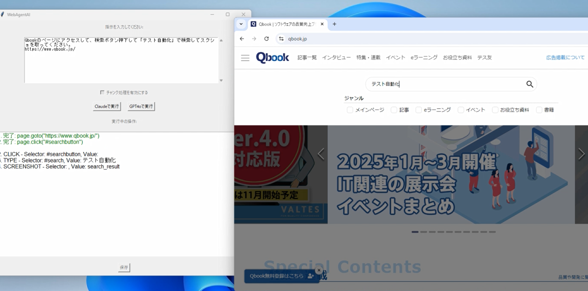

# 概要

LLM でブラウザを操作する WebAIAgent です。

cloude または AzureOpenAI 　+ playwright で動作



動かすには下記がマストで必要です。

- cloude の API キー
  - ANTHROPIC_API_KEY
- AzureOpenAI の API キー
  - DEPLOYMENT_GPT_NAME
  - AZURE_OPENAI_API_KEY
  - AZURE_OPENAI_API_BASE
  - AZURE_OPENAI_API_VERSION

.env ファイル作成して API キー記載してください。

```.env
DEPLOYMENT_GPT_NAME=XXXXXX
AZURE_OPENAI_API_VERSION=XXXXXX
AZURE_OPENAI_API_KEY=XXXXXX
AZURE_OPENAI_API_BASE=XXXXXX
ANTHROPIC_API_KEY=XXXXXX
```

# 環境構築

以下は、Python 仮想環境の作成とアクティブ化の手順です。VS Code を使った場合も含めて説明します。

## 1. **仮想環境の作成**

コマンドプロンプトやターミナルで以下を実行してください。

```bash
python -m venv myenv
```

- `myenv` は仮想環境の名前で、任意に変更できます。

## 2. **仮想環境のアクティブ化**

仮想環境を有効化するには、OS ごとに以下の手順を実行します。

- **Windows:**

  ```bash
  myenv\Scripts\activate
  ```

- **Mac/Linux:**
  ```bash
  source myenv/bin/activate
  ```

アクティブになると、コマンドプロンプトの先頭に `(myenv)` などと表示されます。

## 3. **必要なライブラリをインストール**

仮想環境をアクティブにした状態で、`requirements.txt` に記載されたパッケージをインストールします。

```bash
pip install -r requirements.txt
```

---

### **VS Code を使った手順**

## 1. **Python 拡張機能のインストール**

- VS Code の拡張機能マーケットプレイスから「Python」拡張をインストールします。

## 2. **プロジェクトフォルダを開く**

- 仮想環境を作成するプロジェクトフォルダを VS Code で開きます。

## 3. **仮想環境の作成**

ターミナルを VS Code 内で開き（`Ctrl + Shift + ~`）、以下を実行します。

```bash
python -m venv myenv
```

## 4. **仮想環境を選択**

- VS Code のコマンドパレット（`Ctrl + Shift + P`）を開き、「Python: Select Interpreter」を選択します。
- 一覧から作成した仮想環境（例: `myenv`）を選択します。

## 5. **仮想環境のアクティブ化**

ターミナル内で以下を実行します。

- **Windows:**

  ```bash
  myenv\Scripts\activate
  ```

- **Mac/Linux:**
  ```bash
  source myenv/bin/activate
  ```

## 6. **パッケージのインストール**

仮想環境がアクティブな状態で、以下を実行します。

```bash
pip install -r requirements.txt
```

---

これで、仮想環境の作成、アクティブ化、および VS Code での設定が完了します。

## 7. **main.py を実行する**

python main.py

# ディレクトリ構成

```
web_agent/
├── main.py
├── config.py
├── clients/
│ ├── init.py
│ ├── claude_client.py
│ ├── gpt4_client.py
│ └── openai_client.py
├── controllers/
│ ├── init.py
│ └── playwright_controller.py
├── parsers/
│ ├── init.py
│ └── dom_parser.py
├── gui/
│ ├── init.py
│ └── web_agent_gui.py
├── utils/
│ ├── init.py
│ └── logger.py
└── requirements.txt
```

# 各ファイルおよびディレクトリの役割

- 1.main.py: アプリケーションのエントリーポイント。設定の読み込み、クライアントやコントローラーの初期化、GUI の起動を行います。

- 2.config.py: 環境変数の読み込みと設定の検証を行うクラスを定義します。

- 3.clients/: 各種 API クライアントを管理するモジュール。
  - claude_client.py: Claude API との通信を担当するクラス。
  - gpt4_client.py: GPT-4（Azure OpenAI）の API との通信を担当するクラス。
  - openai_client.py: 複数のクライアントを統括するクラス。
- 4.controllers/: 外部ツールやライブラリを操作するクラスを管理します。
  - playwright_controller.py: Playwright を使用したブラウザ操作を担当するクラス。
- 5.parsers/: データ解析や変換を行うクラスを管理します。

  - dom_parser.py: DOM の解析を担当するクラス。

- 6.gui/: GUI 関連のクラスを管理します。
  - web_agent_gui.py: Tkinter を使用した GUI のクラス。
- 7.utils/: ユーティリティ関係の関数や設定を管理します。
  - logger.py: ログ設定を行う関数。
- 8.requirements.txt: 必要な Python パッケージをリストアップします。
